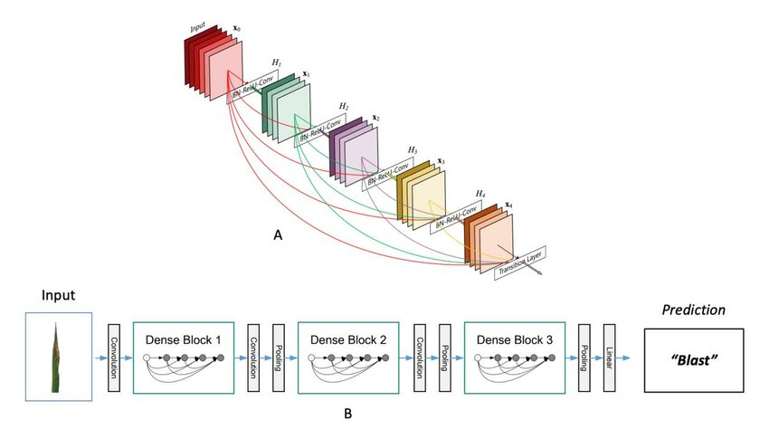

<h1 align="center">PHÁT HIỆN BỆNH VIÊM PHỔI THÔNG QUA ẢNH CHỤP X-QUANG</h1>

<div align="center">

<p align="center">
  
    
</p>

[](https://www.facebook.com/DNUAIoTLab)
[](https://fitdnu.net/)
[](https://dainam.edu.vn)
</div>

<h2 align="center">Sử dụng mô hình DenseNet121 phát hiện bệnh viêm phổi qua ảnh x-quang</h2>

<p align="left">
Sử dụng DenseNet121 phát hiện bệnh viêm phổi qua ảnh x-quang là ứng dụng của AI trong lĩnh vực y tế. DenseNet121 được ứng dụng rộng rãi trong phân loại ảnh y tế, giúp đưa ra phán đoán về tỷ lệ mắc bệnh viêm phổi một cách nhanh và chính xác. Việc vận tốt dụng mô hình này giúp giảm thiểu chi phí khám chữa bệnh, nhanh chóng xác nhận được tình trạng bệnh
</p>

---

## 🌟 Giới thiệu
-Khi đưa dữ liệu ảnh x-quang vào mô hình sẽ trả về kết quả dự đoán người đó có mắc bệnh viêm phổi không
<br>
-Chắc chắn rằng không thể nào đúng được 100% và cũng vẫn sẽ có lỗi xảy ra
---


## 🛠️ CÔNG NGHỆ SỬ DỤNG

<div align="center">

<p align="center">
  
</p>
</div>

##  Yêu cầu hệ thống

-Có thể sử dụng Visual nếu máy đủ khoẻ 
<br>
or
<br>
-Sử dụng <a href="https://colab.google/" target="_blank">Colab</a> cho nhanh

## 🚀 Hướng dẫn cài đặt và chạy


 <h2>Bước 1: Thu thập dữ liệu</h2>
    <p>Thu thập dữ liệu các hình ảnh x-quang ngực từ các bệnh viện</p>
    <h2>Bước 2: Gán nhãn dữ liệu</h2>
    <p>Chia dữ liệu ra làm 2 lớp Normal và Pneumonia</p>
   <p>Dataset </p> <a href="https://www.kaggle.com/datasets/paultimothymooney/chest-xray-pneumonia" target="_blank">Tại Đây</a> 
    <h2>Bước 3: Upload file lên Google Drive</h2>
    <p>Để tải dữ liệu lên Google Drive, bạn có thể sử dụng giao diện web hoặc API.</p>
    <h2>Bước 4: Vào Colab để Train</h2>
    <p>Truy cập vào Google Colab để thực hiện huấn luyện mô hình DenseNet121.</p>
    <h2>Bước 5: Liên kết Colab với Google Drive</h2>
    <p>Trong Google Colab, sử dụng lệnh sau để gắn kết Google Drive:</p>
    <pre><code>from google.colab import drive
drive.mount('/content/drive')</code></pre>
    <h2>Bước 6: Tải các thư viện cần thiết</h2>
    <p>Sử dụng các lệnh sau để cài đặt các thư viện cần thiết:</p>
    <pre><code>
      
!pip install tensorflow
!pip install numpy
!pip install opencv-python
!pip install matplotlib
</code></pre>
<br>
    <h2>Bước 7: Lựa chọn mô hình DenseNet121</h2>
    <p>Chọn mô hình DenseNet làm mô hình nền tảng</p>
    <pre><code>
    base_model = DenseNet121(weights='imagenet', include_top=False, input_shape=(224, 224, 3))
model = build_model(base_model)
    </code></pre>
<br>
    <h2>Bước 8: Huấn luyện mô hình</h2>
    <p>Sử dụng lệnh sau để huấn luyện mô hình DenseNet121:</p>
```bash
early_stop = EarlyStopping(monitor='val_loss', patience=5, restore_best_weights=True)
reduce_lr = ReduceLROnPlateau(monitor='val_loss', factor=0.5, patience=3, verbose=1, min_lr=1e-7)

history = model.fit(
    train_generator,
    validation_data=val_generator,
    epochs=20,
    callbacks=[early_stop, reduce_lr])
```
<p></p>

<h2>Bước 9: Thiết lập cấu hình Grad-Cam cho mô hình</h2>
    
<p>Sử dụng lệnh sau để thiết lập cấu hình Grad-Cam:<p>

```bash
def grad_cam(model, img_array, layer_name):
    grad_model = Model([model.inputs], [model.get_layer(layer_name).output, model.output])
    with tf.GradientTape() as tape:
        conv_output, predictions = grad_model(img_array)
        loss = predictions[:, 0]
    grads = tape.gradient(loss, conv_output)
    pooled_grads = tf.reduce_mean(grads, axis=(0, 1, 2))
    heatmap = conv_output[0] @ pooled_grads[..., tf.newaxis]
    heatmap = tf.squeeze(heatmap)
    heatmap = tf.maximum(heatmap, 0) / tf.math.reduce_max(heatmap)
    return heatmap.numpy()
```

  ##  Bước 10: Phát hiện ảnh viêm phổi qua ảnh chụp x-quang</h2>
  
Chạy mô hình DenseNet121 để phát hiện bệnh viêm phổi qua ảnh chụp x-quang
    
```bash
def display_gradcam_for_all_images(test_folder, model, layer_name='conv5_block16_concat'):
    for class_name in os.listdir(test_folder):
        class_path = os.path.join(test_folder, class_name)
        if os.path.isdir(class_path):
            for img_name in os.listdir(class_path):
                img_path = os.path.join(class_path, img_name)
                img = cv2.imread(img_path)
                if img is None:
                    continue
                img = cv2.cvtColor(img, cv2.COLOR_BGR2RGB)
                img_resized = cv2.resize(img, (224, 224))
                img_array = np.expand_dims(img_resized, axis=0) / 255.0

                heatmap = grad_cam(model, img_array, layer_name)
                heatmap = cv2.resize(heatmap, (img.shape[1], img.shape[0]))
                heatmap = np.uint8(255 * heatmap)
                heatmap = cv2.applyColorMap(heatmap, cv2.COLORMAP_JET)
                superimposed_img = cv2.addWeighted(img, 0.6, heatmap, 0.4, 0)

                pred = model.predict(img_array)[0][0]

                plt.figure(figsize=(10, 5))
                plt.subplot(1, 2, 1)
                plt.imshow(img)
                plt.title("Original Image")
                plt.axis("off")

                plt.subplot(1, 2, 2)
                plt.imshow(superimposed_img)
                plt.title(f"Grad-CAM - Prediction: {pred:.2%} Pneumonia")
                plt.axis("off")
                plt.show()
```


## 🤝 Đóng góp
Dự án được phát triển bởi 3 thành viên:

| Họ và Tên                | Vai trò                  |
|--------------------------|--------------------------|
| Bùi Quang Tuấn              | Phát triển toàn bộ mã nguồn,kiểm thử, triển khai dự án và thực hiện video giới thiệu,biên                              soạn tài liệu Overleaf ,Powerpoint, thuyết trình, đề xuất cải tiến.|
| Hà Tiến Đạt             | Hỗ trợ bài tập lớn.|
| Nguyễn Văn Bảo Ngọc    | Hỗ trợ bài tập lớn.  |

© 2025 NHÓM 6, CNTT 17-15, TRƯỜNG ĐẠI HỌC ĐẠI NAM
